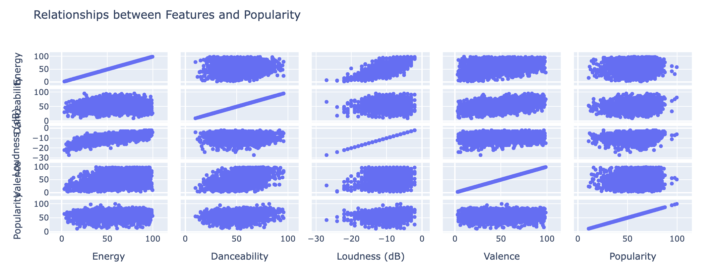
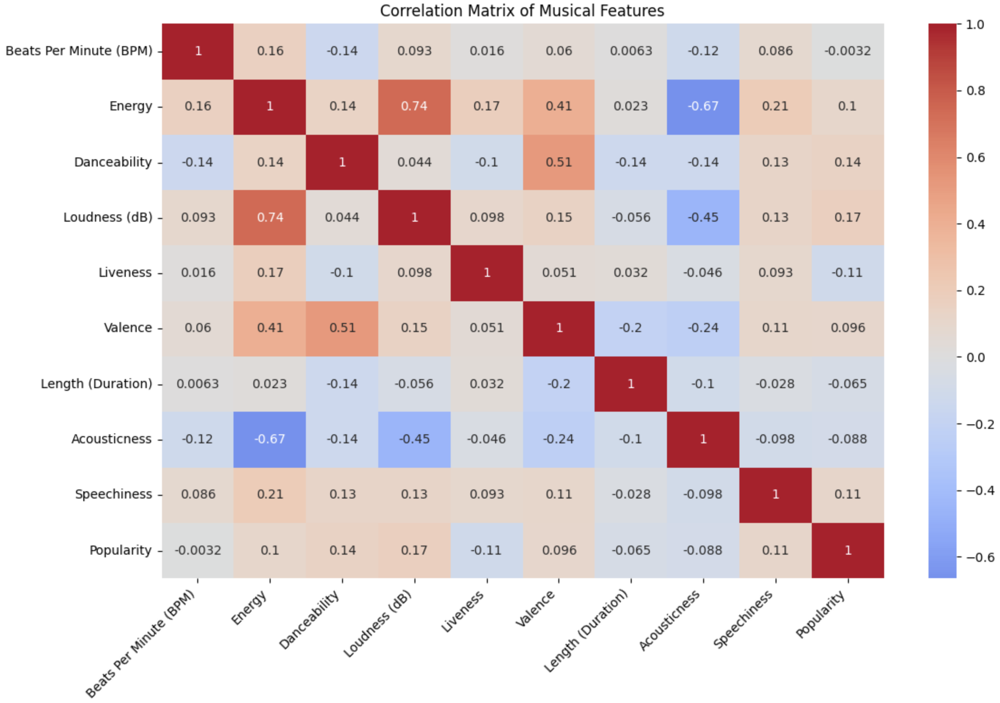
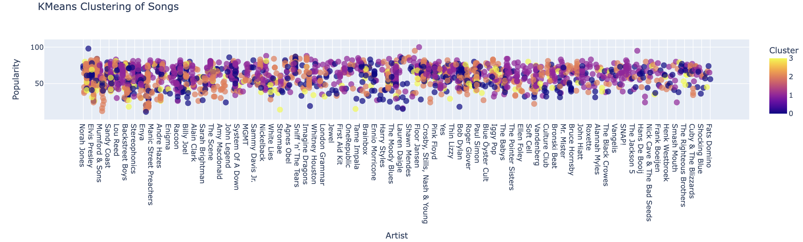

# Spotify 2000 Songs Analysis Dashboard

An interactive data visualization dashboard analyzing Spotify's top 2000 songs, built with Plotly Dash. The project combines machine learning (K-means clustering) with audio preview functionality to create an engaging exploration of music trends, genres, and song characteristics.

## Project Overview

This project evolved through several key development stages:

1. **Data Analysis & Cleaning**: Initial exploration of the Spotify dataset to understand patterns and relationships between song features.
2. **Machine Learning Integration**: Implementation of K-means clustering to group songs into meaningful categories.
3. **Audio Integration**: Addition of song preview functionality using the Deezer API.
4. **Dashboard Development**: Creation of an interactive web interface combining all components.

## Directory Structure

```
June_Code_Pudding/
├── app.py                 # Main dashboard application with all visualizations and callbacks
├── audio_preview.py       # Handles audio preview functionality and Deezer API integration
├── data/
│   └── Spotify-2000.csv  # Dataset containing 2000 songs with features and metadata
├── notebooks/
│   ├── eli_analysis_viktor.ipynb   # Extended analysis of audio features and correlations
│   ├── Gio_Audio_Previews.ipynb    # Audio preview implementation and testing
│   └── sohini_kmeans.ipynb         # K-means clustering implementation and analysis
├── audio_previews/        # Cached audio preview files downloaded from Deezer
├── requirements.txt      # Project dependencies and versions
```

### Key Files Explained

#### Core Application Files

- **`app.py`**: The heart of the dashboard, built with Plotly Dash. Contains:
  - Dashboard layout and styling
  - Interactive visualization components
  - Callback functions for user interactions
  - Data processing and visualization logic
  - Audio preview integration

- **`audio_preview.py`**: Handles all audio-related functionality:
  - Deezer API integration for song previews
  - Audio file downloading and caching
  - Preview URL management
  - Error handling for audio requests

#### Data
- **`data/Spotify-2000.csv`**: Main dataset containing:
  - Song metadata (title, artist, year)
  - Audio features (BPM, energy, danceability)
  - Popularity metrics
  - Genre classifications

#### Jupyter Notebooks

- **`eli_analysis_viktor.ipynb`**: Advanced analysis:
  - Deep dive into audio features
  - Correlation analysis between features
  - Genre distribution patterns
  - Popularity trend analysis

- **`Gio_Audio_Previews.ipynb`**: Audio preview development:
  - Deezer API integration testing
  - Audio preview download functionality
  - Cache system implementation
  - Error handling and edge cases
  - Prototype of the final audio_preview.py module

- **`sohini_kmeans.ipynb`**: Machine learning implementation:
  - K-means clustering setup
  - Feature selection for clustering
  - Cluster analysis and validation
  - Visualization of cluster characteristics

#### Configuration Files
- **`requirements.txt`**: Project dependencies including:
  - Dash and Plotly for visualization
  - Pandas and NumPy for data processing
  - Scikit-learn for machine learning
  - Deezer-python for API integration
  - Other supporting libraries

## Features

### 1. Music Style Discovery
- Interactive cluster-based song recommendations
- Radar charts showing cluster characteristics
- Audio previews for immediate listening

### 2. Genre Analysis
- Dynamic pie chart of genre distribution
- Historical timeline of music releases
- Adjustable genre display (10 to 149 genres)

### 3. Song Characteristics Explorer
- Interactive feature correlation plots
- Top artists visualization
- Popularity trends across time
- Multi-genre filtering capabilities

### 4. Data Insights
- Comprehensive song metadata
- Audio feature analysis
- Popularity scoring system

## Data Analysis Process

### Initial Exploration

*Analysis of relationships between song features and popularity*

### Feature Correlation

*Heatmap showing relationships between different song characteristics*

### Clustering Analysis

*K-means clustering results showing distinct song groups*

## Setup Instructions

1. **Clone the Repository**
   ```bash
   git clone https://github.com/betanight/June_Code_Pudding.git
   cd June_Code_Pudding
   ```

2. **Create Virtual Environment**
   ```bash
   # macOS/Linux
   python3 -m venv venv
   source venv/bin/activate

   # Windows
   python -m venv venv
   .\venv\Scripts\activate
   ```

3. **Install Dependencies**
   ```bash
   pip install -r requirements.txt
   ```

4. **Run the Dashboard**
   ```bash
   python app.py
   ```

5. **Access the Application**
   - Open your browser
   - Visit `http://localhost:8050`

## Technical Implementation

### Dashboard Components
- **Plotly Dash**: Core framework for interactive visualizations
- **Deezer API**: Integration for audio preview functionality
- **Scikit-learn**: K-means clustering implementation
- **Pandas & NumPy**: Data processing and analysis

### Song Features Analyzed
- **Audio Characteristics**: BPM, Energy, Danceability, Loudness, Valence
- **Metadata**: Artist, Genre, Year, Popularity
- **Derived Features**: Cluster assignments, Genre groupings

### Popularity Scoring (0-100)
- **80-100**: Massive hits everyone knows
- **60-79**: Very popular songs
- **40-59**: Well-known songs
- **20-39**: Moderately known songs
- **0-19**: Less known songs

## Deployment

The dashboard is deployed on Render and automatically updates with new commits to the main branch. Visit the live version at [Spotify Analysis Dashboard](https://june-code-pudding-5.onrender.com).

(*May be slow due to using the free version*)

## Future Enhancements
- Real-time Spotify API integration
- Additional clustering algorithms
- Extended audio preview capabilities
- User preference learning

## Contributing

Contributions are welcome! Feel free to open issues or submit pull requests for any improvements or bug fixes.

## License

This project is licensed under the MIT License - see the LICENSE file for details.

## Acknowledgments

- Spotify Dataset from Kaggle
- Deezer API for audio previews
- Plotly Dash community for visualization components
