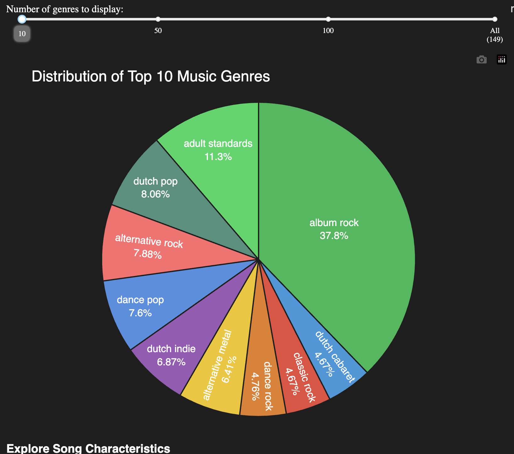

# Spotify Songs Analysis Dashboard

This project analyzes Spotify song data and presents insights through an interactive Plotly Dash dashboard. The analysis is first conducted in a Jupyter notebook to explore the data and determine the most insightful visualizations.



## Project Structure

- `eli_analysis.ipynb`: Jupyter notebook containing data analysis and testing for dash plotly. Analysis reveals that song popularity depends on multiple features working together rather than any single feature, making an interactive dashboard ideal for finding personalized song recommendations.

- `requirements.txt`: Python dependencies required for the project

- `data/`: Includes the dataset from Kaggle

## Dashboard Features

- **Genre Distribution Visualization**
  - Interactive pie chart showing genre breakdown
  - Adjustable view from top 10 to all 149 genres
  - Clear color coding and hover information

- **Popularity Trends Analysis**
  - Track song popularity across different years
  - Visual popularity ranges (Massive Hits to Less Known)
  - Genre filtering capabilities
  - Trend line showing average popularity

- **Feature Correlation Explorer**
  - Compare different song characteristics
  - Interactive scatter plots
  - Detailed hover information for each song

## Setup Instructions

1. **Clone the Repository**
   ```bash
   git clone <repository-url>
   cd <repository-name>
   ```

2. **Create and Activate Virtual Environment (Optional but Recommended)**
   ```bash
   # On macOS/Linux
   python3 -m venv venv
   source venv/bin/activate

   # On Windows
   python -m venv venv
   .\venv\Scripts\activate
   ```

3. **Install Dependencies**
   ```bash
   pip install -r requirements.txt
   ```

4. **Run the Dashboard**
   ```bash
   python app.py
   ```

5. **Access the Dashboard**
   - Open your web browser
   - Navigate to `http://127.0.0.1:8050`
   - Start exploring the data!

## Data Features Explained

- **Popularity Score (0-100)**
  - 80-100: Massive hits everyone knows
  - 60-79: Very popular songs
  - 40-59: Well-known songs
  - 20-39: Moderately known songs
  - 0-19: Less known songs

## Analysis Examples

### Relationship between Features and Popularity:


### Heatmap of Feature Correlation:


## Tech Stack

- Dash
- Plotly
- Pandas
- NumPy
- Scikit-learn
- Seaborn

## Next Steps
1. Explore and clean the Spotify dataset
2. Create various visualizations to understand the data
3. Select the most insightful visualizations for the dashboard
4. Implement the Plotly Dash dashboard

## Contributing

Feel free to open issues or submit pull requests if you have suggestions for improvements or find any bugs.
